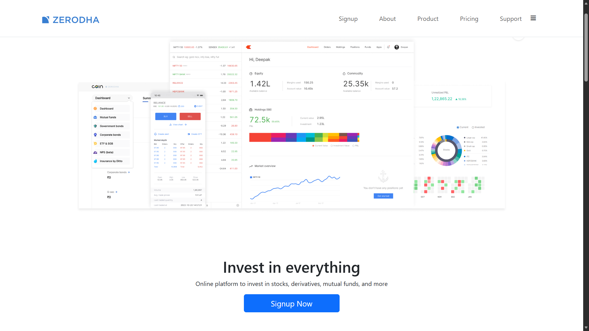
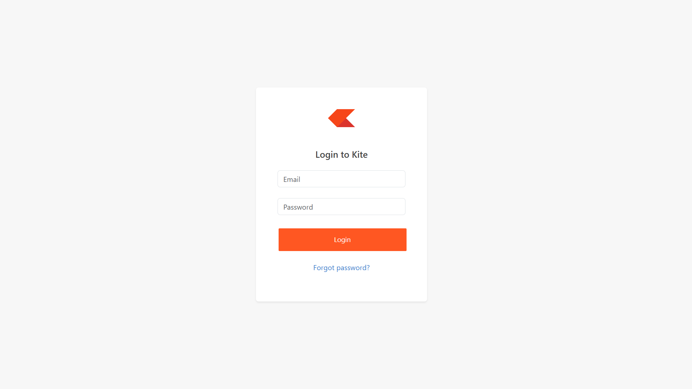
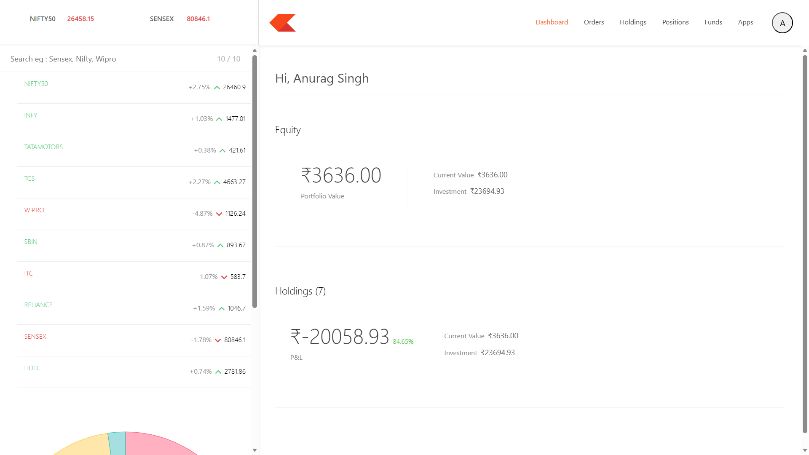
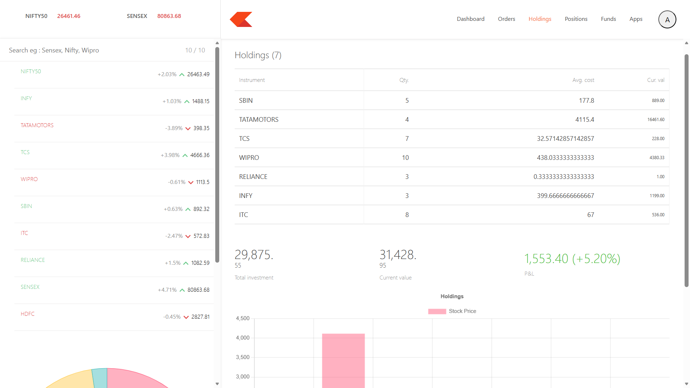
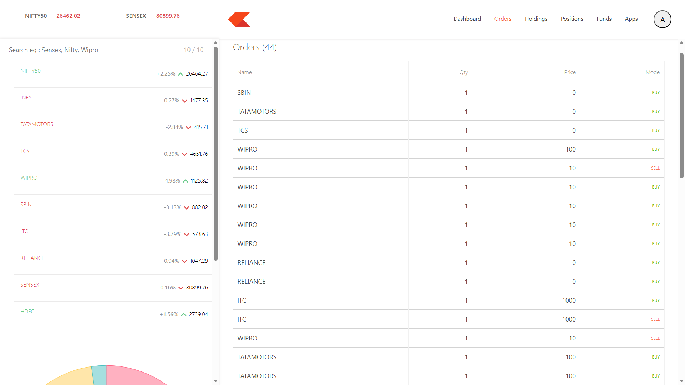
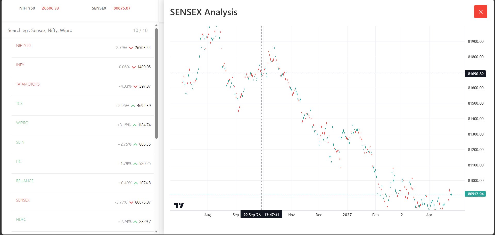
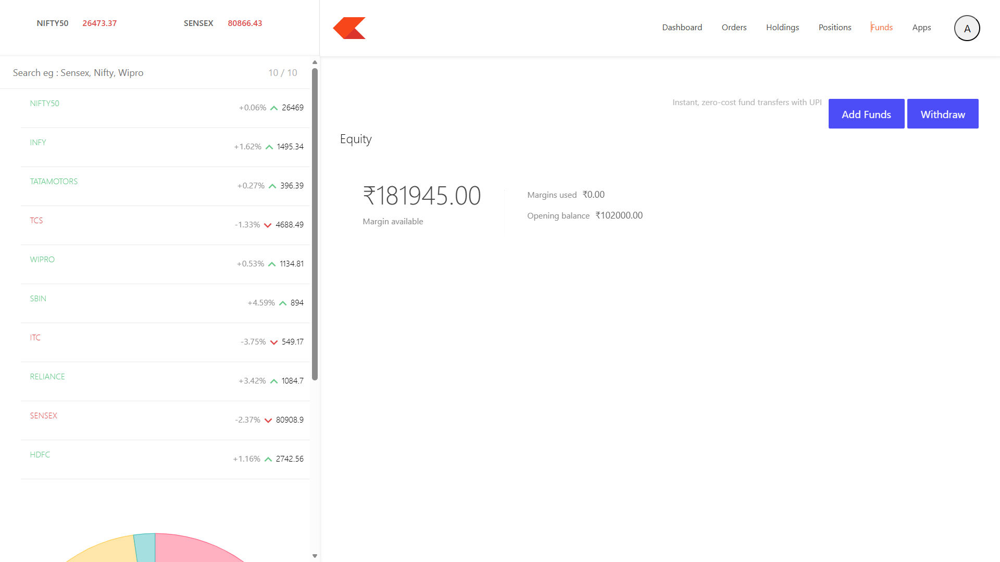
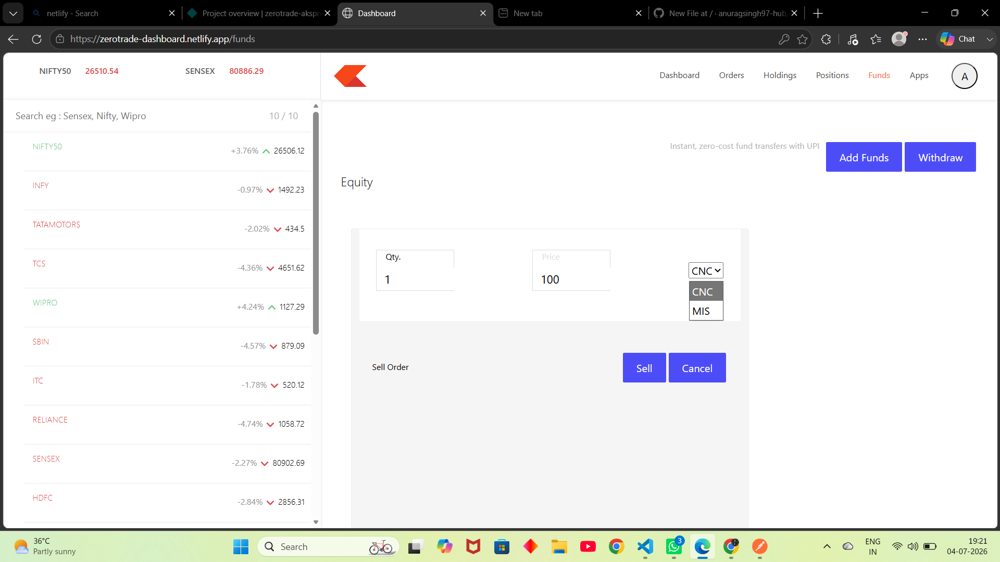
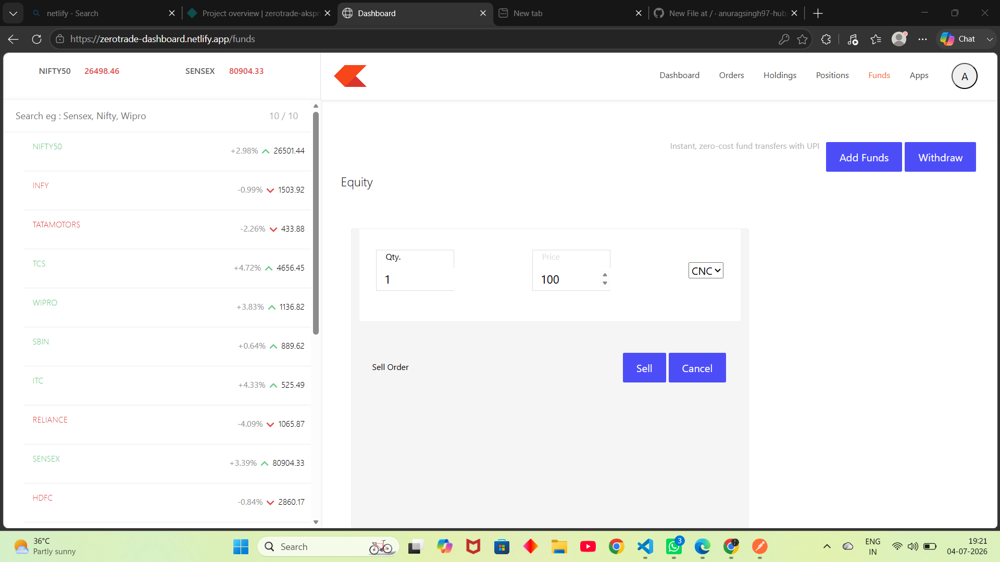

# 🚀 ZeroTrade - Full Stack Stock Trading Platform

ZeroTrade is a full-stack stock trading platform inspired by Zerodha. It allows users to create an account, manage their portfolio, place buy/sell orders, monitor holdings, track positions, and view real-time market data through interactive charts.

The project is built using the MERN Stack with secure JWT authentication, responsive UI, and REST APIs.

---

## 🌐 Live Demo

### Frontend (Landing Page)
https://zerotrade-aksproject.netlify.app

### Dashboard
https://zerotrade-dashboard.netlify.app


## 📸 Screenshots

### 🏠 Home Page



---

### 🔐 Login Page



---

### 📊 Dashboard



---

### 💼 Holdings



---

### 📋 Orders



---

### Analysis



---

### 💰 Funds



---

###  Buy



###  Sell



# ✨ Features

## Authentication

- User Registration
- Secure Login
- JWT Authentication
- HTTP Only Cookies
- Logout
- Protected Routes

---

## Dashboard

- Interactive Dashboard
- Portfolio Summary
- Watchlist
- Holdings
- Positions
- Orders
- Funds
- Profile Management

---

## Trading

- Buy Stocks
- Sell Stocks
- Automatic Holdings Update
- Position Tracking
- Order History

---

## Portfolio

- Available Cash
- Used Margin
- Holdings Value
- Profit & Loss
- Current Investment

---

## Stock Market

- Live Stock Prices
- Real-Time Updates
- Candlestick Charts
- Watchlist Management

---

## Security

- Password Hashing using bcrypt
- JWT Authentication
- HTTP Only Cookies
- Protected Backend APIs
- Protected Dashboard Routes

---

# 🛠 Tech Stack

## Frontend

- React
- React Router DOM
- Axios
- Bootstrap
- Material UI
- CSS

---

## Backend

- Node.js
- Express.js
- JWT
- bcrypt
- Cookie Parser
- CORS

---

## Database

- MongoDB
- Mongoose

---

## Deployment

Frontend:
- Netlify

Dashboard:
- Netlify

Backend:
- Render

Database:
- MongoDB Atlas

---

# 📁 Project Structure

```
ZeroTrade
│
├── frontend
│   ├── Landing Page
│   ├── Login
│   ├── Signup
│   └── Profile
│
├── dashboard
│   ├── Summary
│   ├── Holdings
│   ├── Orders
│   ├── Positions
│   ├── Funds
│   ├── Watchlist
│   └── Charts
│
└── backend
    ├── Controllers
    ├── Routes
    ├── Middleware
    ├── Models
    └── Database
```

---

# ⚙️ Installation

Clone the repository

```bash
git clone https://github.com/anuragsingh97/ZeroTrade.git
```

Move into the project

```bash
cd ZeroTrade
```

Install dependencies

Frontend

```bash
cd frontend
npm install
```

Dashboard

```bash
cd dashboard
npm install
```

Backend

```bash
cd backend
npm install
```

---

# ▶️ Run Project

Backend

```bash
npm run dev
```

Frontend

```bash
npm run dev
```

Dashboard

```bash
npm run dev
```

---

# 🔑 Environment Variables

Backend

```env
PORT=5000

MONGO_URL=your_mongodb_url

TOKEN_KEY=your_secret_key

CLIENT_URL=https://zerotrade-aksproject.netlify.app

DASHBOARD_URL=https://zerotrade-dashboard.netlify.app
```

Frontend

```env
VITE_API_URL=https://zerotrade-aksproject.netlify.app
```

Dashboard

```env
VITE_API_URL=https://zerotrade-dashboard.netlify.app
```

---

# 🔒 Authentication Flow

1. User Registers
2. Password is hashed
3. JWT Token is generated
4. JWT stored as HTTP Only Cookie
5. Every protected API verifies JWT
6. User accesses Dashboard
7. Logout clears Cookie
8. Protected Routes redirect unauthenticated users

---

# 🚀 Future Improvements

- Live Market API Integration
- Stock Search
- Advanced Candlestick Charts
- Portfolio Analytics
- News Feed
- Notifications
- Stop Loss
- Limit Orders
- Dark Mode
- Admin Panel

---

# 👨‍💻 Author

**Anurag Singh**

GitHub:
https://github.com/anuragsingh97-hub

LinkedIn:
https://linkedin.com/in/anurag-kr-singh-273134336

---

# ⭐ Support

If you like this project, consider giving it a ⭐ on GitHub!
